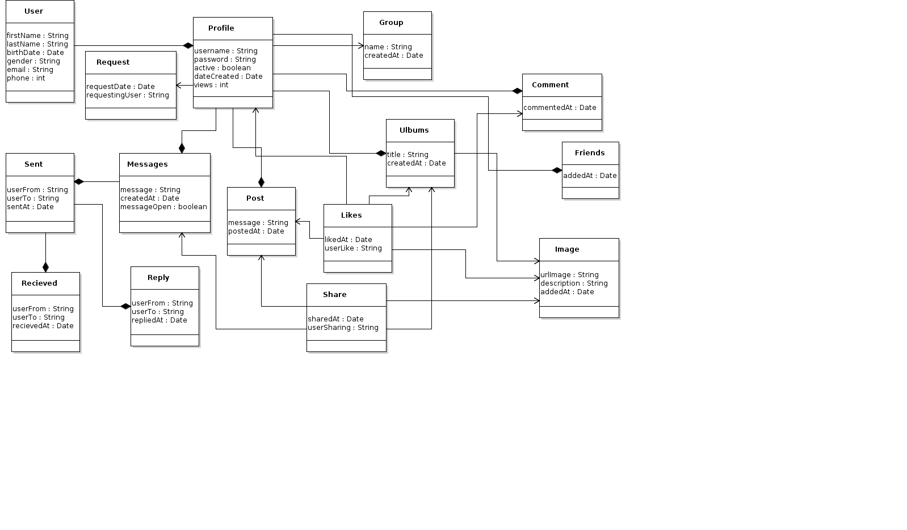

## BBB the app

B4B is an **Android Mobile** app, that will connect People, this app is inspired by the trend **Blesser**. Although there are many ways to connect using your smart phone, but the is no dedicated platform **showboating**. Users will be able to link their **Social Media** sites such as **Facebook**, **Twitter** and **Instagram** . Privacy is our main focus, so It is up to the User stay anonymous or be public. Users will also be able to **Post**, **Comment**, **Share** and **Chat** to other registered Users.

## Domain Model

## Code Example

Coming soon!

## Motivation

We saw an opportunity, even though we knew that this app is not good for community upliftment, but at the of the day we are Developers and Designers. Desire, Hunger to push our limits is what makes us as Human grow and strive. 

## Installation

Comming soon!

## Tests

Coming soon!

## Contributors

To contrube just fork the, or clone the repository.

## License

This software is under [GNU General Public License v3.0](https://opensource.org/licenses/lgpl-3.0.html)
